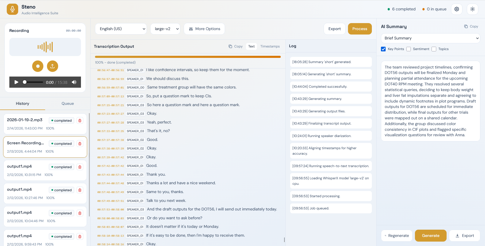

# Steno

Steno helps you turn long recordings into useful written content. Upload a meeting, interview, lecture, or call recording, and it produces a transcript, optional speaker labels, and shareable summaries so you can review key points quickly without replaying the full audio.

For developers, Steno is a FastAPI + WhisperX transcription workspace with queued background processing, multi-format exports, and OpenAI-compatible summary generation.

## Screenshot



## Features

- Upload audio or video files (`mp3`, `wav`, `m4a`, `mp4`, `mov`, `mkv`, and more)
- Automatic media handling (video to audio via FFmpeg)
- WhisperX transcription with timestamp alignment
- Optional speaker diarization (Hugging Face token required)
- Export outputs as `txt`, `srt`, `vtt`, `tsv`, `json`
- Generate or regenerate AI summaries (`short`, `detailed`, `bullet`, `action_items`)
- Queue-based processing with persisted job history
- Global settings persisted in `storage/global_settings.json`

## Installation (Local)

This follows the original repository setup flow (install prerequisites, install deps, configure environment, run app), updated to use `uv`.

### 1. Prerequisites

- Python 3.11+
- FFmpeg available on `PATH`
- Git
- `uv` package manager

Install `uv` if needed:

```bash
pip install uv
```

### 2. Clone and enter project

```bash
git clone https://github.com/rajwanur/steno.git
cd steno
```

### 3. Create and activate virtual environment

```bash
uv venv .venv
```

PowerShell:

```powershell
.venv\Scripts\Activate.ps1
```

macOS/Linux:

```bash
source .venv/bin/activate
```

### 4. Install dependencies

```bash
uv pip install -r requirements.txt
```

### 5. Create environment file

```bash
cp .env.example .env
```

At minimum, configure only what you need:

- `HF_TOKEN` only if diarization is enabled
- `LLM_API_BASE`, `LLM_API_KEY`, `LLM_MODEL` only if AI summaries are enabled

## Run

Development (auto-reload):

```bash
uv run uvicorn app.main:app --host 0.0.0.0 --port 8000 --reload
```

Non-development / regular runtime:

```bash
uv run uvicorn app.main:app --host 0.0.0.0 --port 8000
```

Open `http://localhost:8000`.

## Configuration: `.env` vs Settings

Steno now stores most day-to-day configuration in persisted settings, not only in `.env`.

- `.env` provides startup defaults.
- Runtime defaults are managed from the UI Settings modal and saved to `storage/global_settings.json`.
- Settings are exposed via API:
  - `GET /api/settings/global`
  - `PUT /api/settings/global`

Common settings now managed in persisted Settings:

- Transcription defaults: model, language, batch size, device, compute type
- LLM setup: API base URL, API key, model
- Diarization token: `hf_token`
- Retention behavior: source files, processed audio, export files
- App runtime values: host, port, reload
- Summary prompt templates

## API Endpoints

### Configuration

- `GET /api/config`  
  Returns available models/formats, app metadata, and effective defaults.
- `GET /api/settings/global`
- `PUT /api/settings/global`

### Jobs

- `POST /api/jobs`  
  Multipart upload with form fields such as `model_name`, `language`, `batch_size`, `device`, `compute_type`, `diarization`, `summary_enabled`, `summary_style`, and `output_formats` (JSON array string).
- `GET /api/jobs`
- `GET /api/jobs/{job_id}`
- `POST /api/jobs/{job_id}/cancel`
- `DELETE /api/jobs/{job_id}`  
  Requires query params: `confirm=true` and `confirm_text=<exact filename>`.

### Output and Summaries

- `GET /api/jobs/{job_id}/output/{fmt}` (preview)
- `GET /api/jobs/{job_id}/download/{fmt}` (download transcript/export file)
- `POST /api/jobs/{job_id}/summary` (regenerate summary)
- `GET /api/jobs/{job_id}/summary/export` (download summary as Markdown)

### Queue

- `POST /api/queue/clear`  
  Optional query param: `include_active` (default: `true`).

## Docker

```bash
docker compose up --build
```

Service URL: `http://localhost:8000`  
Data persists in `./storage`.

## Project Structure

```text
.
├── app
│   ├── api
│   ├── core
│   ├── services
│   ├── utils
│   ├── config.py
│   ├── main.py
│   └── schemas.py
├── static
├── templates
├── storage
├── Dockerfile
├── docker-compose.yml
├── requirements.txt
└── README.md
```

## Operational Notes

- `device=auto` is a safe default for most environments.
- On many Windows AMD setups, CPU mode can be more stable.
- Diarization requires a valid Hugging Face token with model access.

## License

MIT
